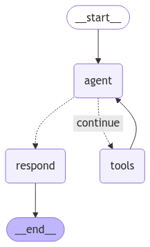

# Project Setup Instructions

This is a minimal agent workflow I created for data-extraction-services using the LangGraph framework. It is a basic implementation of an Agent with a single tool, and a downstream formatting agent with Pydantic structured output. Use a Python virtual environment to manage dependencies and ensure compatibility. Follow the steps below to set up your environment and configure Jupyter Notebook to use it.

- LangGraphAgent.py 
    - Basic agent workflow class that can be customized for use cases
- minimal_agent_framework.ipynb
    - A notebook demonstrating the minimal agent workflow for the ingredients task of the product scanner. (scraper as tool, parser and formater as agents)

---

# LangGraphAgentSystem

## Overview
`LangGraphAgentSystem` is a class designed to implement a minimal agentic framework using the LangGraph library. It facilitates structured conversations by enabling a single agent with tools to route and interact with downstream agents, generating structured outputs. This implementation is especially suited for integrating tools, handling workflows, and ensuring consistent and structured responses.

---
## Schematic Diagram 

</img>

---

## Features
- **Azure OpenAI Integration**: Supports seamless interaction with Azure OpenAI's API.
- **Tool Management**: Provides tools to perform specific tasks, such as fetching weather information.
- **Workflow Management**: Uses LangGraph's `StateGraph` for workflow execution.
- **Structured Outputs**: Ensures consistent response formatting using pydantic models.
- **Monitoring and Logging**: Integrates with Langfuse for detailed monitoring and interaction logging.


---

## How It Works

1. **Initialization**:
   - Loads environment variables using `dotenv`.
   - Initializes Langfuse for monitoring/observability and Azure OpenAI for LLM implementation.

2. **Tool Creation**:
   - Defines and registers tools, the basic example is a weather-fetching tool.

3. **Workflow Execution**:
   - Manages conversation flow between agent, tools, and user response using a `StateGraph`.

4. **Structured Responses**:
   - Ensures consistent outputs using pydantic models and structured formatting.

---

## Usage

### Example Code
```python
from LangGraphAgent import LangGraphAgentSystem

# Final Pydantic Structured Output Classes for Minimal Agent Workflow
class WeatherResponse(BaseModel):
    """Respond to the user with this"""
    temperature: float = Field(description="The temperature in fahrenheit")
    wind_directon: str = Field(
        description="The direction of the wind in abbreviated form"
    )
    wind_speed: float = Field(description="The speed of the wind in km/h")

class AgentState(MessagesState):
    # Final structured response from the agent
    final_response: WeatherResponse

# An input dictionary for the
input_dict = {
    "input_prompt":"what's the weather in SF?",
    "agent_prompt":"You are a helpful assistant! Your name is Bob.",
    "agent_state":AgentState,
    "structured_output_class":WeatherResponse
}


# Create a subclass for LangGraphAgentSystem to inherit all functionality, but override tools with a custom tooling. 
class CustomAgentWorkflow(LangGraphAgentSystem):
    def create_tools(lg):
        @tool
        def get_weather(city: Literal["nyc", "sf"]):
            """Use this to get weather information."""
            if city == "nyc":
                return "It is cloudy in NYC, with 1000 mph winds in the North-East direction and a temperature of 70 degrees"
            elif city == "sf":
                return "It is 75 degrees and sunny in SF, with 1000 mph winds in the South-East direction"
            else:
                raise AssertionError("Unknown city")

        tools = [get_weather]
        lg.tools = tools

# instantiate
caw = CustomAgentWorkflow(input_dict)

# run orchestrating method for the workflow
answer = caw.run()

# display output
answer
```

---

## Class Details

### Constructor
```python
LangGraphAgentSystem(input_dict: dict)
```
Initializes the class with an input dictionary containing configuration and prompt data.

**Parameters:**
- `input_dict`: A dictionary containing keys like `agent_state`, `agent_prompt`, and `input_prompt`.

---

### Methods

#### `initialize_model`
```python
def initialize_model(self) -> None
```
Initializes the Azure OpenAI model with Langfuse monitoring and binds tools for structured output handling.

#### `create_tools`
```python
def create_tools(self) -> None
```
Creates and registers tools for the agent. The basic default tool is a tool to fetch weather information for NYC and SF.

#### `call_model`
```python
def call_model(self, state: MessagesState) -> Dict[str, List[SystemMessage]]
```
Appends a system message to the conversation state and invokes the model to generate a response.

#### `respond`
```python
def respond(self, state: MessagesState) -> Dict[str, Union[str, HumanMessage]]
```
Processes the last tool message and generates a structured response.

#### `should_continue`
```python
def should_continue(self, state: MessagesState) -> Literal["respond", "continue"]
```
Determines whether to continue the workflow or respond to the user based on the last message in the conversation.

#### `create_workflow`
```python
def create_workflow(self) -> Any
```
Creates a `StateGraph` for managing the conversation workflow, defining transitions and node interactions.

#### `run`
```python
def run(self) -> Any
```
Executes the entire workflow, from tool creation and model initialization to workflow execution. Returns the final response.

---

## Environment Variables
Ensure the following environment variables are set:

- `AZURE_OPENAI_API_KEY`: Your Azure OpenAI API key.
- `AZURE_OPENAI_ENDPOINT`: Your Azure OpenAI endpoint.
- `AZURE_OPENAI_DEPLOYMENT_NAME`: The deployment name for your Azure OpenAI instance.
- `LANGFUSE_SECRET_KEY`: Secret key for Langfuse.
- `LANGFUSE_PUBLIC_KEY`: Public key for Langfuse.
- `LANGFUSE_HOST`: Host URL for Langfuse.

---

## Workflow Overview

### Nodes
1. **`agent`**: Invokes the model using `call_model`.
2. **`respond`**: Generates user-facing responses using `respond`.
3. **`tools`**: Handles tool interactions using a `ToolNode`.

### Transitions
- From `agent`:
  - If `should_continue` returns `"continue"`, transition to `tools`.
  - If `should_continue` returns `"respond"`, transition to `respond`.
- From `tools`, cycle back to `agent`.
- From `respond`, end the workflow.

---

## Contributing
Feel free to contribute to the project by submitting issues or pull requests.

---

## License
This project is licensed under the MIT License.


## Prerequisites
Ensure you have the following installed:
- Python 3.x
- pip
- Jupyter Notebook

---

## Setup Steps

### 1. Create a Virtual Environment
Create a Python virtual environment named `venv`:
```bash
python -m venv venv
```

### 2. Activate the Virtual Environment

- On macOS/Linux:
  ```bash
  source venv/bin/activate
  ```
- On Windows:
  ```bash
  venv\Scripts\activate
  ```

Once activated, your terminal prompt should reflect the virtual environment.

### 3. Install Dependencies
Install the required Python packages:
```bash
pip install -r requirements.txt
```

### 4. Ensure Jupyter Notebook Has Access to the Virtual Environment
Add your virtual environment as a kernel in Jupyter Notebook:
```bash
python -m ipykernel install --user --name=venv --display-name "Python (venv)"
```


### 5. Select the Virtual Environment Kernel
1. Open the minimal_agent_framework notebook or create a new one.
2. Select the kernel dropdown (usually at the top-right).
3. Choose `Python (venv)` from the list.

